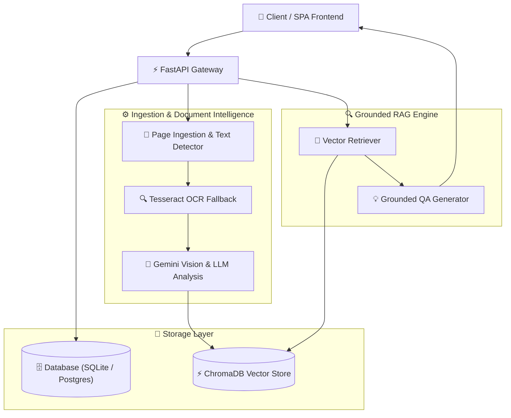

# DocuMind AI — Universal Multimodal Document Intelligence & Grounded RAG Platform

> **DocuMind AI** is an AI-powered document intelligence platform designed to ingest, analyze, summarize, and query complex native and scanned documents (Patents, Academic Papers, Technical Manuals, Legal Contracts, Financial Reports, Invoices, and Images).

---

## 🌟 Overview & Capabilities

Enterprise and academic documents come in diverse formats and layouts:
- Scanned image pages without text layers
- Structural tables and multi-column layouts
- Native PDF documents, patents, contracts, and reports

**DocuMind AI** solves this problem by combining layout-aware ingestion, Tesseract OCR fallback, Gemini multimodal vision & LLM structured extraction, **instant automatic vector indexing into ChromaDB**, and **Grounded Retrieval-Augmented Generation (RAG)** with page-level citations.

---

## 🔥 Key Features

- **Universal PDF & Document Ingestion**: Automatic detection of text layers with fast PyMuPDF native extraction and Tesseract OCR fallback for scanned pages.
- **Multimodal Intelligence & Summarization**: Gemini LLM extraction for Document Title, Category/Type, Executive Summary, Key Topics, and Key Entities.
- **Instant Automatic Vector Indexing**: Uploaded documents are automatically processed, approved, and indexed directly into the **ChromaDB vector database** for immediate Q&A.
- **Grounded RAG Q&A Engine**: Strict context-bounded answer generation with page-level citations (`[Page 1]`, `[Page 3]`).
- **Hallucination Protection**: Explicitly refuses to answer questions unsupported by document evidence.
- **Strict User Privacy & Data Isolation**: Every signed-in user strictly accesses and queries only their own uploaded documents.
- **Real-Time Interactive UI**: Responsive React + Vite dashboard with live background status polling.

---

## 🏗️ Architecture



---

## 🛠️ Tech Stack

- **Frontend**: React (Vite SPA), TailwindCSS, Lucide Icons
- **Backend Framework**: Python 3.11, FastAPI, Uvicorn, Pydantic v2
- **Database & Storage**: PostgreSQL / SQLite (SQLAlchemy ORM), Local Disk Storage
- **OCR & Computer Vision**: Tesseract OCR, PyMuPDF (fitz), Pillow
- **AI & LLM Services**: Google Gemini (`google-genai` SDK)
- **Vector Search**: ChromaDB Vector Database

---

## 🚀 Local Setup & Installation

### 1. Prerequisites
- Python 3.11+
- Node.js 18+
- Tesseract OCR engine (`C:\Program Files\Tesseract-OCR` or system PATH)

### 2. Backend Setup
```bash
cd backend
python -m venv venv
.\venv\Scripts\activate  # On Windows

pip install -r requirements.txt
cp .env.example .env     # Configure GEMINI_API_KEY
python -m uvicorn app.main:app --reload --port 8000
```

### 3. Frontend Setup
```bash
cd frontend
npm install
npm run dev
```
Open `http://localhost:3000` in your browser.

---

## 🔐 Environment Variables

Create `.env` in `backend/`:
```ini
PROJECT_NAME="MultiModal Document Intelligence & RAG"
API_V1_STR="/api/v1"
SECRET_KEY="development-secret-key"
BACKEND_HOST=0.0.0.0
BACKEND_PORT=8000
DATABASE_URL=sqlite:///./doc_rag.db
GEMINI_API_KEY=your_gemini_api_key_here
GEMINI_MODEL=gemini-3.6-flash
CHROMA_PERSIST_DIR="./chroma_data"
STORAGE_LOCAL_DIR="./uploaded_files"
```

---

## 📡 Key API Endpoints

- `POST /api/v1/documents/upload` — Upload document PDF/images
- `POST /api/v1/documents/{id}/process` — Run page ingestion & text extraction
- `POST /api/v1/documents/{id}/extract` — Run Gemini document intelligence & auto-index into ChromaDB
- `POST /api/v1/qa` — Grounded RAG question answering with page citations
- `GET /api/v1/documents` — List user's private documents
- `GET /api/v1/health/ready` — System health status

---

## 📄 License
MIT License. Built for portfolio & multimodal document intelligence RAG showcase.
