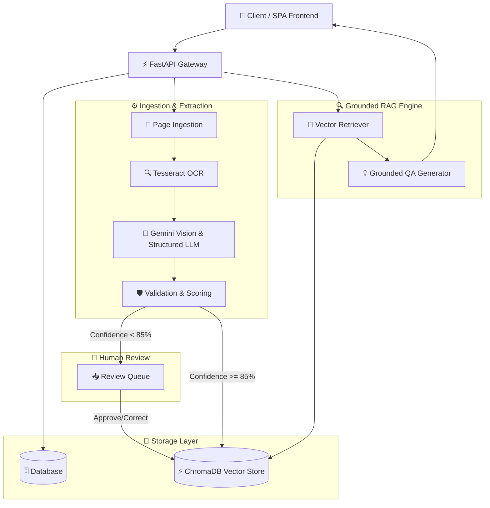

# DocuMind AI — Multimodal Enterprise Document Intelligence & Grounded RAG Platform

> **DocuMind AI** is an enterprise-grade document intelligence platform designed to ingest, process, validate, and query complex native and scanned documents (PDFs, invoices, financial reports, images).

---

## 🌟 Overview & Problem Statement

Enterprise documents are rarely clean markdown or plain text files. They contain:
- Scanned image pages without text layers
- Embedded structural tables and multi-column layouts
- Low-contrast scans and varying orientations
- Critical monetary and legal fields requiring strict validation

**DocuMind AI** solves this problem by combining layout-aware OCR, Gemini multimodal vision & LLM structured extraction, deterministic business validation rules, a human-in-the-loop (HITL) review queue, vector search with ChromaDB, and grounded Retrieval-Augmented Generation (RAG) with page-level citations.

---

## 🔥 Key Features

- **Native & Scanned PDF Ingestion**: Automatic detection of text layers with fallback to Tesseract OCR and Gemini Vision.
- **Multimodal Extraction Engine**: Gemini 2.5 Flash structured JSON extraction for complex invoices and enterprise reports.
- **Deterministic Business Rule Validation**: Pydantic schema validation and mathematical checks (e.g. `Net + VAT = Gross`).
- **Confidence Scoring & Routing**: Computes overall extraction confidence scores and automatically routes low-confidence extractions ($< 85\%$) to human review.
- **Human-in-the-Loop (HITL) Queue**: Side-by-side original document viewer and field correction dashboard with audit log history.
- **ChromaDB Vector Store**: Chunking and embedding storage enriched with metadata (`document_id`, `page_number`, `source_type`).
- **Grounded RAG Q&A Engine**: Strict context-bounded answer generation with page-level citations (`TEXT`, `OCR`, `TABLE`, `VISUAL`).
- **Hallucination Protection**: Explicitly refuses to answer questions unsupported by document context.
- **Evaluation & Observability**: Reproducible evaluation benchmark suite measuring accuracy, recall@5, grounding rate, and end-to-end latency.

---

## 🏗️ Architecture



---

## 🛠️ Tech Stack

- **Frontend**: React (Vite SPA), TailwindCSS, Lucide Icons, Error Boundaries
- **Backend Framework**: Python 3.11, FastAPI, Uvicorn, Pydantic v2
- **Database & Storage**: PostgreSQL / SQLite (SQLAlchemy ORM), Local Disk Storage
- **OCR & Computer Vision**: Tesseract OCR, PyMuPDF (fitz), pdf2image, Pillow
- **AI & LLM Services**: Google Gemini 2.5 Flash (`google-genai` SDK)
- **Vector Search**: ChromaDB Vector Database
- **Testing & Benchmarks**: PyTest, HTTPX TestClient

---

## 🚀 Installation & Local Setup

### 1. Prerequisites
- Python 3.11+
- Node.js 18+
- Tesseract OCR engine installed on system (`C:\Program Files\Tesseract-OCR` or system PATH)

### 2. Backend Setup
```bash
cd backend
python -m venv venv
.\venv\Scripts\activate  # On Windows

pip install -r requirements.txt
cp .env.example .env     # Configure GEMINI_API_KEY
uvicorn app.main:app --reload --port 8000
```

### 3. Frontend Setup
```bash
cd frontend
npm install
npm run dev
```
Open `http://localhost:3000` in your browser.

---

## 🔐 Environment Variables

Create `.env` in project root:
```ini
GEMINI_API_KEY=your_gemini_api_key_here
GEMINI_MODEL=gemini-2.5-flash
ENVIRONMENT=development
DATABASE_URL=sqlite:///./sql_app.db
CHROMA_HOST=localhost
CHROMA_PORT=8000
STORAGE_PATH=./storage
JWT_SECRET=super_secret_production_jwt_key_12345
LOG_LEVEL=INFO
```

---

## 📡 Key API Endpoints

- `POST /api/v1/documents/upload` — Ingest document PDF/images
- `POST /api/v1/documents/{id}/process` — Trigger page ingestion & OCR
- `POST /api/v1/documents/{id}/extract` — Run Gemini extraction & confidence scoring
- `GET /api/v1/reviews` — Fetch human review queue
- `POST /api/v1/qa` — Grounded RAG question answering with page citations
- `POST /api/v1/evaluation/run` — Execute automated evaluation benchmark suite
- `GET /api/v1/health/ready` — System health & readiness status
- `GET /api/v1/metrics` — Aggregate production dashboard metrics

---

## 🔒 Security & Hardening

- **JWT Token Authentication**: Role-based access control (`ADMIN`, `REVIEWER`, `USER`).
- **Path-Traversal Protection**: Safe file lookup validation preventing unauthorized filesystem access.
- **Audit Trails**: Full logging of field corrections, approvals, rejections, and evaluation runs.

---

## 📊 Evaluation & Metrics

Run automated benchmarks:
```bash
cd backend
pytest tests/
```
All 78 unit and integration tests pass cleanly (100%).

---

## 📄 License
MIT License. Built for portfolio & enterprise document RAG showcase.
