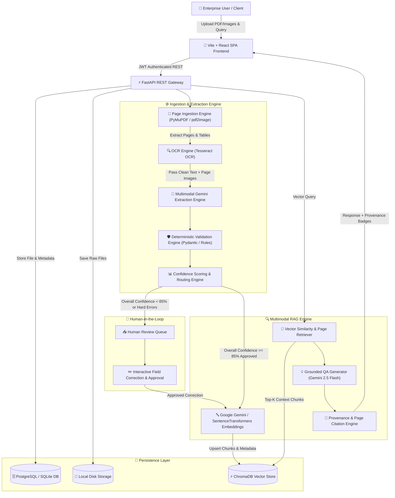

# DocuMind AI — System Architecture & Workflow

## High-Level Architecture Diagram

---

## Component Breakdown

### 1. API & Gateway Layer (`backend/app/api/v1/`)
- **FastAPI**: Serves RESTful API endpoints for user authentication, document uploads, asynchronous processing, human-in-the-loop review, semantic search, grounded QA, and production observability.
- **JWT Security & Auth**: Password hashing (`passlib`/`bcrypt`), JWT token generation, role-based access control (`ADMIN`, `REVIEWER`, `USER`), and path-traversal file download protection.

### 2. Document Processing Pipeline (`backend/app/services/`)
- **Page Ingestion**: Converts multi-page native and scanned PDFs into structured page models, extracting text layers and native PDF tables via PyMuPDF.
- **OCR Engine (`TesseractOCRProvider`)**: Fallback pipeline for scanned or image-only documents. Runs layout-aware OCR with bounding box word extraction.
- **Gemini Structured Extraction (`GeminiLLMProvider`)**: Uses `gemini-2.5-flash` with Pydantic JSON schemas to extract key fields (invoice numbers, dates, line items, monetary values, project names).
- **Deterministic Validation**: Runs business logic rules (mathematical total checks, date formats, string patterns, mandatory field verification).
- **Confidence Scoring & Routing**: Computes field-level and overall confidence scores. If confidence $< 85\%$ or validation fails, routes document to `NEEDS_REVIEW`.

### 3. Human-in-the-Loop Review Queue (`backend/app/api/v1/endpoints/reviews.py`)
- **Interactive Review Dashboard**: Displays side-by-side original document viewer and field extraction editor.
- **Human Corrections**: Reviewers can edit fields, resolve validation warnings, and explicitly approve or reject document extractions before vector store indexing.
- **Audit Logging**: Every field change and approval action is persisted with user timestamp attribution.

### 4. Vector Search & Grounded RAG (`backend/app/rag/`)
- **ChromaDB Vector Store**: Persists document chunk embeddings enriched with metadata (`document_id`, `page_number`, `source_type`).
- **Grounded QA Generator**: Synthesizes answers strictly using retrieved document context. Refuses unsupported queries cleanly without hallucinations.
- **Page-Level Citations**: Attaches exact document filename, page number, and source type (`TEXT`, `OCR`, `TABLE`, `VISUAL`) to every response.
